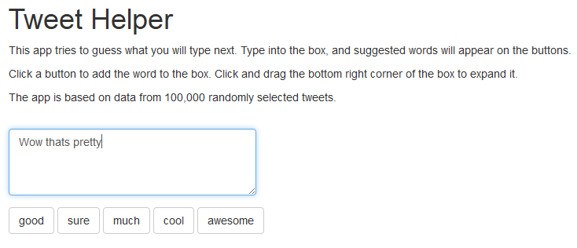

Tweet Helper App
========================================================
author: Jonathan Dorsey
date: June 19, 2018
autosize: true

Tweet Helper
========================================================
- The Tweet Helper App is designed to help users compose tweets more conveniently.
- Just type into the box and the app will generate five suggested words.
- Click on any of the five suggestions if you wish, and it will be added to the text box.
- The app is located [here](https://jnd18.shinyapps.io/tweet-helper/).
- The code is located on github [here](https://github.com/jnd18/data-science-capstone).

Interface
========================================================

- Here we see the interface.
- Beneath the title and simple instructions, there is a text box to type into, and five buttons for adding suggested words
- In this example, the top suggestion is "Wow thats pretty good"

Language Model
========================================================
- The app generates its suggestions using a simple model
- 100,000 tweets were randomly selected and various n-grams were formed
- An n-gram is just a list of n consecutive words. i.e. a 2-gram or bigram is just a pair of words
- Using a list of the most common bigrams, one can predict the next word in a sentence by looking at the last word and then finding all bigrams that start with that word and predicting the most common second words in those bigrams.
- For example, if "thank you" appears often in the text, then we predict "you" to follow "thank"
- Similarly, one can use trigrams to predict using a two word context, and monograms to predict based on no words.

Language Model Continued
========================================================
- The model stores only the top 5 responses for common contexts. For a fuller explanation see the github repo linked to above.
- When predicting text, we use the largest context stored in the model. That may be two words, one word, or no words.
- A second set of 100,000 tweets was used to assess the model's accuracy
- The best prediction (left most button in the app) guessed the correct word 11.6% of the time
- The top 5 predictions contained the correct word 25.2% of the time.

